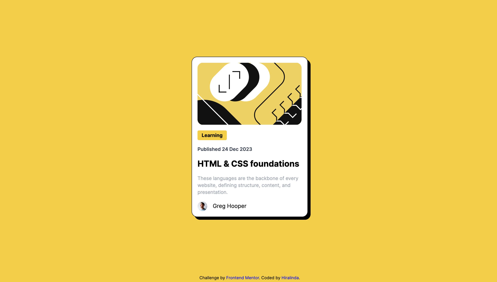

# Frontend Mentor - Blog Preview Card

This is my solution to the [Blog Preview Card on Frontend Mentor](https://www.frontendmentor.io/challenges/blog-preview-card-ckPaj01IcS) built with [Next.js](https://nextjs.org/) and bootstrapped with [`create-next-app`](https://github.com/vercel/next.js/tree/canary/packages/create-next-app).

## Table of contents

- [Overview](#overview)
  - [Screenshot](#screenshot)
  - [Links](#links)
- [My process](#my-process)
  - [Built with](#built-with)
  - [What I learned](#what-i-learned)
  - [Continued development](#continued-development)
  - [Useful resources](#useful-resources)
- [Author](#author)
- [Acknowledgments](#acknowledgments)

## Overview

This project is a simple, responsive Blog Preview Card built as a solution to the [Blog Preview Card challenge on Frontend Mentor](https://www.frontendmentor.io/challenges/qr-code-component-iux_sIO_H). It showcases a clean, centered design featuring a QR code image and descriptive text, demonstrating skills in Next.js, Tailwind CSS, and responsive web design.

### Screenshot

### Links

- Live Site URL: [Blog Preview Card Live Site]()

## My process

### Built with

- [Next.js](https://nextjs.org/) - React framework
- [Tailwind CSS](https://tailwindcss.com/) - For styles
- Semantic HTML5 markup
- Mobile-first workflow

### What I learned

This project helped reinforce my understanding of:
- Setting up a Next.js project with Tailwind CSS
- Creating responsive layouts using Tailwind's utility classes
- Implementing custom styles within the Tailwind framework
- Handling different screen sizes with responsive design techniques

### Continued development

In future projects, I'd like to focus on:
- Exploring more advanced Next.js features like server-side rendering and API routes
- Deepening my understanding of Tailwind CSS customization
- Improving accessibility features
- Implementing more complex state management in React components

### Useful resources

- [Next.js Documentation](https://nextjs.org/docs): The official Next.js documentation was crucial for understanding the project setup and basic routing.
- [Tailwind CSS Documentation](https://tailwindcss.com/docs): This resource was invaluable for learning how to effectively use Tailwind's utility classes and customize the design.
- [react with utkarsh YouTube Channel](https://www.youtube.com/watch?v=rDJPbot4Frc&ab_channel=reactwithutkarsh):  This channel provided excellent tutorials on React and Next.js implementation.
- [Frontend Mentor](https://www.frontendmentor.io): The challenge itself provided great practice for implementing designs and improving front-end skills.

## Author

- Frontend Mentor - [@hiralinda](https://www.frontendmentor.io/profile/hiralinda)

## Acknowledgments

Thanks to Frontend Mentor for providing this challenge and to the online developer community for their invaluable resources and support. Special thanks to the Next.js and Tailwind CSS teams for creating such powerful and developer-friendly tools.
